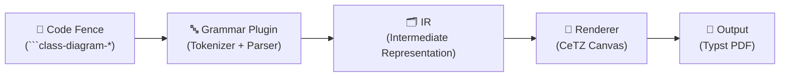

# cetz-classuml — Pacote Typst para Diagramas de Classe UML

## Descrição do Problema

Criar um pacote Typst chamado **cetz-classuml** que renderiza diagramas de classe UML utilizando [CeTZ](https://github.com/cetz-package/cetz) como engine de desenho. O pacote deve:

1. Aceitar a **mesma sintaxe do PlantUML** para diagramas de classe como entrada
2. Ter um **sistema de gramáticas plugável** — permitindo criar novos parsers (ex: código Java real, C# real) que geram o mesmo diagrama
3. Funcionar como um **projeto do ecossistema CeTZ** (similar ao [fletcher](https://github.com/Jollywatt/typst-fletcher))
4. Ser invocado via **code fences** no Typst (` ```class-diagram-plantuml `)

---

## Decisões Confirmadas

| Decisão | Valor |
|---------|-------|
| Nome do pacote | `cetz-classuml` |
| Versão CeTZ | `0.5.0` |
| Versão compilador Typst | `0.14.2` |
| Visibilidade padrão | `"package"` (quando não especificada) |
| Gramáticas Java/C# | **Código real** — keywords reais da linguagem |
| Layout v0.1.0 | Grid simples com hierarquia |
| API de invocação | Code fences com show rules |

---

## Arquitetura Geral

O pacote segue uma arquitetura em **3 camadas** inspirada no padrão compilador:



### Camada 1 — Grammar Plugin (Parser)
- Cada gramática é um arquivo `.typ` que exporta uma função `parse(text) → IR`
- O PlantUML é a gramática padrão (`grammars/plantuml.typ`)
- Java e C# usam **sintaxe real** das linguagens, com inferência semântica de relações
- Novas gramáticas podem ser criadas como arquivos `.typ` separados

### Camada 2 — Intermediate Representation (IR)
- Estrutura de dados em dicionários Typst que representa o diagrama
- Independente da sintaxe de entrada e do renderizador
- Contém: classes, relações, packages, metadata

### Camada 3 — Renderer (CeTZ)
- Recebe o IR e desenha o diagrama usando CeTZ canvas
- Responsável por: layout automático, class boxes, setas de relação, theming

---

## API de Invocação — Code Fences

O pacote utiliza **show rules** no Typst para interceptar raw blocks com linguagens específicas:

```typst
// No documento do usuário:
#import "src/lib.typ": setup-classuml
#show: setup-classuml

// Agora code fences funcionam como diagramas:
```

### Sintaxe PlantUML
````typst
```class-diagram-plantuml
@startuml
abstract class Animal {
  - String nome
  - int idade
  + String getNome()
  + {abstract} void emitirSom()
}

class Cachorro {
  - String raca
  + void latir()
}

interface Alimentavel {
  + void alimentar()
}

Animal <|-- Cachorro
Cachorro ..|> Alimentavel
@enduml
```
````

### Sintaxe Java (código real)
````typst
```class-diagram-java
public abstract class Animal {
  private String nome;
  private int idade;
  public String getNome() {}
  public abstract void emitirSom();
}

public class Cachorro extends Animal {
  private String raca;
  private Coleira coleira;

  public Cachorro(Coleira coleira) {
    this.coleira = coleira;
  }

  public void latir() {
    Brinquedo b = new Brinquedo();
  }
}

public interface Alimentavel {
  void alimentar();
}

public class Coleira {}
public class Brinquedo {}

Cachorro implements Alimentavel
```
````

**Inferência semântica de relações no Java/C#:**

| Padrão no código | Relação Inferida | Tipo UML |
|-------------------|------------------|----------|
| `extends ClassName` | Herança | `<\|--` (linha sólida + triângulo) |
| `implements InterfaceName` | Implementação | `<\|..` (tracejada + triângulo) |
| Atributo do tipo outra classe: `private Foo foo;` | Associação | `-->` |
| Parâmetro do construtor: `Cachorro(Coleira c)` | Agregação | `o--` |
| Instanciação em método: `new Brinquedo()` | Composição | `*--` |

### Sintaxe C# (código real)
````typst
```class-diagram-csharp
public abstract class Animal {
  private string Nome;
  private int Idade;
  public string GetNome() {}
  public abstract void EmitirSom();
}

public class Cachorro : Animal {
  private string Raca;
  private Coleira coleira;

  public Cachorro(Coleira coleira) {
    this.coleira = coleira;
  }

  public void Latir() {
    Brinquedo b = new Brinquedo();
  }
}

public interface IAlimentavel {
  void Alimentar();
}

Cachorro : IAlimentavel
```
````

### Implementação do Show Rule

```typst
// Em src/lib.typ:
#let setup-classuml(doc) = {
  show raw.where(lang: "class-diagram-plantuml"): it => {
    _render-diagram(it.text, grammar: "plantuml")
  }
  show raw.where(lang: "class-diagram-java"): it => {
    _render-diagram(it.text, grammar: "java")
  }
  show raw.where(lang: "class-diagram-csharp"): it => {
    _render-diagram(it.text, grammar: "csharp")
  }
  doc
}
```

---

## Estrutura de Arquivos

```text
d:\dev\typst\classuml\
├── typst.toml                    # Manifest do pacote
├── src/
│   ├── lib.typ                   # Entry point + exports + show rules
│   ├── deps.typ                  # Dependências centralizadas (CeTZ)
│   ├── ir.typ                    # Definição do IR (structs/construtores)
│   ├── parser/
│   │   ├── mod.typ               # Orquestrador de parsing
│   │   └── utils.typ             # Utilitários de parsing de texto
│   ├── grammars/
│   │   ├── mod.typ               # Registry de gramáticas
│   │   ├── plantuml.typ          # Gramática PlantUML (padrão)
│   │   ├── java.typ              # Gramática Java real
│   │   └── csharp.typ            # Gramática C# real
│   ├── renderer/
│   │   ├── mod.typ               # Orquestrador de renderização
│   │   ├── class-box.typ         # Desenho de class boxes
│   │   ├── relations.typ         # Desenho de setas/relações
│   │   ├── layout.typ            # Algoritmo de layout automático
│   │   └── theme.typ             # Theming + estilização
│   └── utils.typ                 # Utilitários gerais
├── main.typ                      # Arquivo de teste/demonstração
├── tests/
│   ├── test-plantuml.typ         # Testes com sintaxe PlantUML
│   ├── test-java.typ             # Testes com gramática Java
│   └── test-csharp.typ           # Testes com gramática C#
└── docs/
    └── manual.typ                # Manual/documentação
```

---

## Proposed Changes

### Componente 1 — Package Foundation

---

#### [NEW] [typst.toml](file:///d:/dev/typst/classuml/typst.toml)

```toml
[package]
name = "cetz-classuml"
version = "0.1.0"
compiler = "0.14.2"
entrypoint = "src/lib.typ"
authors = ["Leandro"]
license = "MIT"
description = "UML Class Diagrams for Typst, built on CeTZ. Supports PlantUML syntax with pluggable grammars (Java, C#)."
repository = ""
categories = ["visualization", "components"]
keywords = ["uml", "class-diagram", "plantuml", "cetz", "diagram"]
exclude = ["tests/", "docs/"]
```

---

#### [NEW] [deps.typ](file:///d:/dev/typst/classuml/src/deps.typ)

```typst
#import "@preview/cetz:0.5.0"
```

---

#### [NEW] [lib.typ](file:///d:/dev/typst/classuml/src/lib.typ)

Entry point do pacote. Exporta a API pública com show rules para code fences.

```typst
#import "deps.typ": cetz
#import "ir.typ"
#import "parser/mod.typ" as parser
#import "grammars/mod.typ" as grammars
#import "renderer/mod.typ" as renderer

/// Função interna — parseia e renderiza um diagrama
#let _render-diagram(source, grammar: "plantuml", ..options) = {
  let ir = parser.parse(source, grammar: grammar)
  renderer.render(ir, ..options)
}

/// Função de setup — aplica show rules para code fences.
/// Uso: #show: setup-classuml
#let setup-classuml(
  theme: auto,
  spacing: (x: 3.5, y: 2.5),
  doc,
) = {
  show raw.where(lang: "class-diagram-plantuml"): it => {
    _render-diagram(it.text, grammar: "plantuml", theme: theme, spacing: spacing)
  }
  show raw.where(lang: "class-diagram-java"): it => {
    _render-diagram(it.text, grammar: "java", theme: theme, spacing: spacing)
  }
  show raw.where(lang: "class-diagram-csharp"): it => {
    _render-diagram(it.text, grammar: "csharp", theme: theme, spacing: spacing)
  }
  doc
}

/// Função direta para uso programático (alternativa aos code fences)
#let class-diagram(source, grammar: "plantuml", theme: auto, spacing: (x: 3.5, y: 2.5)) = {
  _render-diagram(source, grammar: grammar, theme: theme, spacing: spacing)
}
```

---

### Componente 2 — Intermediate Representation (IR)

---

#### [NEW] [ir.typ](file:///d:/dev/typst/classuml/src/ir.typ)

Define construtores para todas as entidades do diagrama.

**Construtores principais:**

```typst
/// Cria um membro (atributo ou método)
#let uml-member(
  name: "",
  return-type: none,
  visibility: "package",    // PADRÃO = package
  modifiers: (),            // ("static", "abstract")
  kind: "field",            // "field" ou "method"
  params: (),               // Para métodos: lista de (name, type)
) = (...)

/// Cria uma classe/interface/enum/abstract
#let uml-class(
  name: "",
  type: "class",            // "class", "abstract", "interface", "enum", "annotation"
  stereotype: none,
  members: (),
  generics: none,
) = (...)

/// Cria uma relação entre classes
#let uml-relation(
  from: "",
  to: "",
  type: "association",      // Ver tabela abaixo
  label: none,
  from-card: none,          // Cardinalidade origem
  to-card: none,            // Cardinalidade destino
) = (...)

/// Cria um package
#let uml-package(
  name: "",
  classes: (),
  style: none,
) = (...)

/// Raiz do IR
#let uml-diagram(
  classes: (),
  relations: (),
  packages: (),
) = (...)
```

**Tipos de Relação:**

| Símbolo PlantUML | Tipo IR | Descrição UML | Estilo da Seta |
|-------------------|---------|---------------|----------------|
| `<\|--` | `"inheritance"` | Herança | Linha sólida + triângulo vazio |
| `<\|..` | `"implementation"` | Implementação | Linha tracejada + triângulo vazio |
| `*--` | `"composition"` | Composição | Linha sólida + diamante cheio |
| `o--` | `"aggregation"` | Agregação | Linha sólida + diamante vazio |
| `-->` | `"association"` | Associação | Linha sólida + seta |
| `..>` | `"dependency"` | Dependência | Linha tracejada + seta |
| `--` | `"link"` | Ligação simples | Linha sólida |
| `..` | `"dashed-link"` | Ligação tracejada | Linha tracejada |

**Visibilidade:**

| Símbolo PlantUML | Keyword Java/C# | Valor IR | Significado |
|------------------|-----------------|----------|-------------|
| `+` | `public` | `"public"` | Público |
| `-` | `private` | `"private"` | Privado |
| `#` | `protected` | `"protected"` | Protegido |
| `~` | _(nenhum)_ | `"package"` | Package-private |
| _(nenhum)_ | _(nenhum)_ | `"package"` | **PADRÃO = package** |

**Modificadores:**

| Marcador PlantUML | Keyword Java/C# | Valor IR | Efeito Visual |
|--------------------|-----------------|----------|---------------|
| `{static}` | `static` | `"static"` | Sublinhado |
| `{abstract}` | `abstract` | `"abstract"` | Itálico |

---

### Componente 3 — Sistema de Gramáticas

---

#### [NEW] [grammars/mod.typ](file:///d:/dev/typst/classuml/src/grammars/mod.typ)

Registry central de gramáticas.

```typst
#import "plantuml.typ"
#import "java.typ"
#import "csharp.typ"

#let builtin-grammars = (
  "plantuml": plantuml.parse,
  "java":     java.parse,
  "csharp":   csharp.parse,
)

/// Resolve uma gramática por nome ou aceita função custom
#let resolve-grammar(grammar) = {
  if type(grammar) == str {
    assert(grammar in builtin-grammars,
      message: "Gramática '" + grammar + "' não encontrada.")
    builtin-grammars.at(grammar)
  } else if type(grammar) == function {
    grammar
  }
}
```

**Contrato da Gramática — toda gramática deve exportar:**
```typst
/// parse(source: str) -> dictionary
/// Retorna: (classes: (...), relations: (...), packages: (...))
#let parse(source) = { ... }
```

---

#### [NEW] [grammars/plantuml.typ](file:///d:/dev/typst/classuml/src/grammars/plantuml.typ)

Parser da sintaxe PlantUML para diagramas de classe.

**Suporte (Fase 1 — MVP):**
- Declarações: `class`, `abstract class`, `interface`, `enum`, `annotation`
- Body com `{ }` e membros
- Visibilidade: `+`, `-`, `#`, `~` (default → `"package"`)
- Modificadores: `{static}`, `{abstract}`
- Relações: `<|--`, `<|..`, `*--`, `o--`, `-->`, `..>`, `--`, `..`
- Labels: `A --> B : label`
- Cardinalidades: `A "1" *-- "many" B`
- Stereotypes: `<<stereotype>>`
- Generics: `Class<T>`
- Separadores de body: `--`, `..`, `==`, `__`

**Algoritmo de parsing:**
```
1. Remover @startuml / @enduml (se presentes)
2. Separar por linhas, trim cada uma
3. Estado: current-class = none, brace-depth = 0
4. Para cada linha:
   a. Vazia ou comentário → skip
   b. Keyword de tipo (class/abstract/interface/enum) → criar uml-class
   c. Contém "{" → brace-depth += 1, iniciar coleta de membros
   d. Contém "}" → brace-depth -= 1, fechar classe
   e. brace-depth > 0 → parsear como membro (visibilidade + tipo + nome)
   f. Contém operador de relação → parsear como uml-relation
   g. "package Name {" → iniciar package
5. Retornar uml-diagram(classes, relations, packages)
```

---

#### [NEW] [grammars/java.typ](file:///d:/dev/typst/classuml/src/grammars/java.typ)

Parser de **código Java real**. Diferente do PlantUML, usa keywords nativas do Java.

**Keywords reconhecidas:**

| Categoria | Keywords |
|-----------|----------|
| Tipo | `class`, `abstract class`, `interface`, `enum` |
| Visibilidade | `public`, `private`, `protected`, _(default = package)_ |
| Modificadores | `static`, `abstract`, `final` |
| Herança | `extends` |
| Implementação | `implements` |
| Tipos primitivos | `int`, `float`, `double`, `boolean`, `char`, `byte`, `short`, `long`, `void`, `String` |

**Inferência semântica de relações:**

```java
public class Cachorro extends Animal {
    // ➜ HERANÇA: Cachorro <|-- Animal

    private Coleira coleira;
    // ➜ ASSOCIAÇÃO: Cachorro --> Coleira
    //   (atributo cujo tipo é outra classe do diagrama)

    public Cachorro(Dono dono) {
        this.dono = dono;
    }
    // ➜ AGREGAÇÃO: Cachorro o-- Dono
    //   (parâmetro do construtor cujo tipo é outra classe)

    public void brincar() {
        Brinquedo b = new Brinquedo();
    }
    // ➜ COMPOSIÇÃO: Cachorro *-- Brinquedo
    //   (instanciação com `new` dentro de método)
}

public class Gato implements Alimentavel, Domesticavel {
    // ➜ IMPLEMENTAÇÃO: Gato <|.. Alimentavel
    // ➜ IMPLEMENTAÇÃO: Gato <|.. Domesticavel
}
```

**Algoritmo de parsing Java:**
```
1. Separar linhas, trim
2. Estado: current-class, brace-depth, in-constructor, in-method
3. Para cada linha:
   a. Detectar declaração de classe/interface/enum:
      - Regex-like: [visibility] [abstract] class Name [extends X] [implements Y,Z] {
      - Extrair tipo, nome, herança, implementações
   b. Detectar membro:
      - [visibility] [static] [abstract] Type name;  → atributo
      - [visibility] [static] [abstract] Type name(...) { → método
      - Se Type é uma classe conhecida → registrar associação
   c. Detectar construtor:
      - ClassName(...) { → coletar parâmetros
      - Parâmetros cujo tipo é outra classe → registrar agregação
   d. Dentro de método, detectar `new ClassName()` → composição
   e. Linha explícita `A implements B` ou `A extends B` → relação
4. Pós-processamento:
   - Para cada classe, verificar atributos cujo tipo é outra classe
   - Gerar relações de associação/agregação/composição
5. Retornar uml-diagram(classes, relations, packages)
```

**Diferenciação de tipos para inferência:**
- **Tipos primitivos** (`int`, `String`, `boolean`, etc.) → NÃO geram relação
- **Tipos que são classes do diagrama** → geram relação
- **Arrays/Listas** (`List<Foo>`, `Foo[]`) → geram relação com cardinalidade `*`

---

#### [NEW] [grammars/csharp.typ](file:///d:/dev/typst/classuml/src/grammars/csharp.typ)

Parser de **código C# real**. Mesma lógica do Java, com sintaxe C#.

**Diferenças em relação ao Java:**

| Conceito | Java | C# |
|----------|------|-----|
| Herança | `extends` | `:` |
| Implementação | `implements` | `:` (mesmo que herança) |
| Tipos primitivos | `int`, `boolean` | `int`, `bool`, `string` |
| Interface naming | `Alimentavel` | `IAlimentavel` (convenção I-prefix) |
| Properties | getter/setter explícitos | `{ get; set; }` |

**Inferência de relações — idêntica ao Java:**
- Atributo de tipo classe → Associação
- Parâmetro de construtor de tipo classe → Agregação
- `new ClassName()` em método → Composição
- `: BaseClass` → Herança
- `: IInterface` (com prefixo `I`) → Implementação

---

### Componente 4 — Parser Engine

---

#### [NEW] [parser/mod.typ](file:///d:/dev/typst/classuml/src/parser/mod.typ)

Orquestrador de parsing.

```typst
#import "../grammars/mod.typ" as grammars

/// Parseia source text usando a gramática especificada, retorna IR validado
#let parse(source, grammar: "plantuml") = {
  let parse-fn = grammars.resolve-grammar(grammar)
  let ir = parse-fn(source)
  assert("classes" in ir, message: "IR inválido: faltando 'classes'")
  assert("relations" in ir, message: "IR inválido: faltando 'relations'")
  ir
}
```

---

#### [NEW] [parser/utils.typ](file:///d:/dev/typst/classuml/src/parser/utils.typ)

Utilitários compartilhados entre gramáticas:

- `trim-line(line)` — remove espaços e comentários (`//`, `/* */`)
- `split-tokens(line)` — divide uma linha em tokens por espaços
- `parse-visibility-symbol(token)` — extrai visibilidade PlantUML (`+`, `-`, `#`, `~`)
- `parse-visibility-keyword(token)` — extrai visibilidade Java/C# (`public`, `private`, `protected`)
- `detect-relation-operator(line)` — detecta operadores de relação PlantUML na linha
- `extract-between(text, open, close)` — extrai conteúdo entre delimitadores
- `parse-stereotype(text)` — extrai `<<Nome>>` de uma string
- `is-primitive-type(type-name)` — verifica se é tipo primitivo (não gera relação)
- `extract-generic-type(text)` — extrai `T` de `List<T>` ou `Foo<Bar>`

---

### Componente 5 — Renderer (CeTZ)

---

#### [NEW] [renderer/mod.typ](file:///d:/dev/typst/classuml/src/renderer/mod.typ)

Orquestrador de renderização.

```typst
#import "../deps.typ": cetz
#import "class-box.typ"
#import "relations.typ"
#import "layout.typ"
#import "theme.typ"

/// Renderiza um IR como canvas CeTZ
#let render(ir, theme: auto, spacing: (x: 3.5, y: 2.5), ..options) = {
  let the-theme = if theme == auto { theme.default-theme } else { theme }
  // 1. Calcular tamanhos das class boxes
  let sizes = class-box.measure-all(ir.classes, the-theme)
  // 2. Computar posições via layout
  let positions = layout.compute(ir, sizes: sizes, spacing: spacing)

  cetz.canvas({
    import cetz.draw: *
    // 3. Desenhar class boxes
    for cls in ir.classes {
      let pos = positions.at(cls.name)
      let size = sizes.at(cls.name)
      class-box.draw-class(cls, pos, size, the-theme)
    }
    // 4. Desenhar relações
    for rel in ir.relations {
      let from-pos = positions.at(rel.from)
      let from-size = sizes.at(rel.from)
      let to-pos = positions.at(rel.to)
      let to-size = sizes.at(rel.to)
      relations.draw-relation(rel, from-pos, from-size, to-pos, to-size, the-theme)
    }
  })
}
```

---

#### [NEW] [renderer/class-box.typ](file:///d:/dev/typst/classuml/src/renderer/class-box.typ)

Desenha uma class box UML com CeTZ:

```text
┌─────────────────────┐
│   «interface»       │  ← Stereotype (se houver)
│     ClassName       │  ← Nome (negrito; itálico se abstract)
│     <T extends E>   │  ← Generics (se houver)
├─────────────────────┤
│ ~ field1: String    │  ← Atributos (~ = package = default)
│ # field2: int       │
├─────────────────────┤
│ + method1(): void   │  ← Métodos
│ + method2(x: int)   │
└─────────────────────┘
```

**Implementação com CeTZ:**
- `rect()` para box externo com `corner-radius`
- `rect()` colorido para header
- `line()` para separadores entre seções
- `content()` para textos (nome, membros)
- Cores do header variam por tipo (class, interface, enum, abstract)
- Membros `{static}`/`static` → sublinhado
- Membros `{abstract}`/`abstract` → itálico
- Ícones de visibilidade com cores: `+` verde, `-` vermelho, `#` amarelo, `~` azul

---

#### [NEW] [renderer/relations.typ](file:///d:/dev/typst/classuml/src/renderer/relations.typ)

Desenha relações UML entre class boxes:

| Tipo | Linha | Ponta da Seta | Desenho CeTZ |
|------|-------|---------------|--------------|
| Herança | Sólida | Triângulo vazio △ | `line()` + `polygon(fill: white)` |
| Implementação | Tracejada | Triângulo vazio △ | `line(stroke: (dash: "dashed"))` + `polygon(fill: white)` |
| Composição | Sólida | Diamante cheio ◆ | `line()` + `polygon(fill: black)` |
| Agregação | Sólida | Diamante vazio ◇ | `line()` + `polygon(fill: white)` |
| Associação | Sólida | Seta simples → | `line()` + mark |
| Dependência | Tracejada | Seta simples → | `line(stroke: (dash: "dashed"))` + mark |

**Funcionalidades:**
- Cálculo automático de ponto de conexão (borda do box mais próxima)
- Labels posicionados no ponto médio da linha
- Cardinalidades posicionadas próximas às extremidades
- Routing reto (não ortogonal para v0.1.0)

---

#### [NEW] [renderer/layout.typ](file:///d:/dev/typst/classuml/src/renderer/layout.typ)

Layout automático em grid com hierarquia:

```
Algoritmo:
1. Análise de hierarquia:
   - Classes sem pais (raízes) → nível 0
   - Classes que herdam → nível do pai + 1
   - Interfaces → mesmo nível que quem as implementa
2. Distribuição em grid:
   - Cada nível = uma linha vertical
   - Dentro do nível: distribuir horizontalmente
   - Centralizar cada nível
3. Ajustes:
   - Respeitar spacing.(x, y)
   - Evitar sobreposição baseado nos tamanhos reais dos boxes
```

---

#### [NEW] [renderer/theme.typ](file:///d:/dev/typst/classuml/src/renderer/theme.typ)

Tema visual padrão:

```typst
#let default-theme = (
  class-header: (
    "class":      (fill: rgb("#ADD8E6"), stroke: rgb("#4682B4")),
    "abstract":   (fill: rgb("#DDA0DD"), stroke: rgb("#8B008B")),
    "interface":  (fill: rgb("#90EE90"), stroke: rgb("#228B22")),
    "enum":       (fill: rgb("#FFD700"), stroke: rgb("#B8860B")),
    "annotation": (fill: rgb("#FFB6C1"), stroke: rgb("#DC143C")),
  ),
  class-body: (fill: white, stroke: rgb("#888888")),
  font: (
    class-name: (size: 11pt, weight: "bold"),
    member: (size: 9pt, font: "Cascadia Code"),
    stereotype: (size: 8pt, style: "italic"),
  ),
  visibility-colors: (
    "public":    rgb("#2E8B57"),
    "private":   rgb("#DC143C"),
    "protected": rgb("#DAA520"),
    "package":   rgb("#4169E1"),
  ),
  visibility-symbols: (
    "public":    "+",
    "private":   "-",
    "protected": "#",
    "package":   "~",
  ),
  relation-stroke: 1pt,
  relation-color: rgb("#333333"),
  corner-radius: 3pt,
  padding: 6pt,
)
```

---

### Componente 6 — Demonstração

---

#### [MODIFY] [main.typ](file:///d:/dev/typst/classuml/main.typ)

```typst
#import "src/lib.typ": setup-classuml

#show: setup-classuml

= Exemplo 1: PlantUML

```class-diagram-plantuml
@startuml
abstract class Animal {
  - String nome
  - int idade
  + String getNome()
  + {abstract} void emitirSom()
}
class Cachorro {
  - String raca
  + void latir()
}
class Gato {
  - boolean domestico
  + void miar()
}
interface Alimentavel {
  + void alimentar()
}
enum Porte {
  PEQUENO
  MEDIO
  GRANDE
}
Animal <|-- Cachorro
Animal <|-- Gato
Cachorro ..|> Alimentavel
Cachorro --> Porte
@enduml
```

= Exemplo 2: Java

```class-diagram-java
public abstract class Animal {
  private String nome;
  private int idade;
  public String getNome() {}
  public abstract void emitirSom();
}
public class Cachorro extends Animal {
  private String raca;
  public void latir() {}
}
public class Gato extends Animal implements Alimentavel {
  private boolean domestico;
  public void miar() {}
  public void alimentar() {}
}
public interface Alimentavel {
  void alimentar();
}
```
```

---

## Plano de Execução (Fases)

### Fase 1 — Foundation + Parser PlantUML (MVP)

| # | Tarefa | Arquivos |
|---|--------|----------|
| 1.1 | Criar `typst.toml` e estrutura de diretórios | `typst.toml` |
| 1.2 | Criar `deps.typ` | `src/deps.typ` |
| 1.3 | Definir IR com construtores | `src/ir.typ` |
| 1.4 | Implementar parser utils | `src/parser/utils.typ` |
| 1.5 | Implementar parser PlantUML | `src/grammars/plantuml.typ` |
| 1.6 | Implementar registry de gramáticas | `src/grammars/mod.typ` |
| 1.7 | Implementar orquestrador de parsing | `src/parser/mod.typ` |

### Fase 2 — Renderer CeTZ + Show Rules

| # | Tarefa | Arquivos |
|---|--------|----------|
| 2.1 | Implementar tema padrão | `src/renderer/theme.typ` |
| 2.2 | Implementar class box | `src/renderer/class-box.typ` |
| 2.3 | Implementar relações | `src/renderer/relations.typ` |
| 2.4 | Implementar layout automático | `src/renderer/layout.typ` |
| 2.5 | Implementar orquestrador de rendering | `src/renderer/mod.typ` |
| 2.6 | Integrar lib.typ com show rules | `src/lib.typ` |
| 2.7 | Testar com main.typ PlantUML | `main.typ` |

### Fase 3 — Gramáticas Java e C#

| # | Tarefa | Arquivos |
|---|--------|----------|
| 3.1 | Implementar parser Java com inferência semântica | `src/grammars/java.typ` |
| 3.2 | Implementar parser C# com inferência semântica | `src/grammars/csharp.typ` |
| 3.3 | Testar equivalência IR entre gramáticas | `tests/` |

### Fase 4 — Polish + Features Avançados

| # | Tarefa | Arquivos |
|---|--------|----------|
| 4.1 | Suporte a `package` no PlantUML | `src/grammars/plantuml.typ` |
| 4.2 | Suporte a generics `<T>` | parsers |
| 4.3 | Renderização de packages | `src/renderer/` |
| 4.4 | Melhorias no layout hierárquico | `src/renderer/layout.typ` |

### Fase 5 — Testes + Documentação

| # | Tarefa | Arquivos |
|---|--------|----------|
| 5.1 | Testes PlantUML abrangentes | `tests/test-plantuml.typ` |
| 5.2 | Testes Java/C# | `tests/test-java.typ`, `tests/test-csharp.typ` |
| 5.3 | Manual completo | `docs/manual.typ` |
| 5.4 | Demos finais em main.typ | `main.typ` |

---

## Verification Plan

### Compilação
```powershell
typst compile main.typ main.pdf
typst compile tests/test-plantuml.typ tests/test-plantuml.pdf
typst compile tests/test-java.typ tests/test-java.pdf
typst compile tests/test-csharp.typ tests/test-csharp.pdf
```

### Testes Visuais
- Class boxes com header colorido por tipo
- Ícones de visibilidade corretos (`+`, `-`, `#`, `~`)
- Membros static sublinhados, abstract em itálico
- Setas com pontas corretas (triângulo, diamante, seta)
- Linhas sólidas vs tracejadas corretas
- Labels e cardinalidades posicionados
- Layout sem sobreposição

### Testes de Gramáticas
- Mesmo diagrama em PlantUML e Java deve produzir **mesmo IR**
- Java: `extends` → herança, `implements` → implementação
- Java: atributo de classe → associação, construtor → agregação, `new` → composição
- Gramática custom (função) deve funcionar

### Testes de Robustez
- Input vazio → erro informativo
- Sintaxe inválida → mensagem de erro clara
- Classe sem membros → box minimalista
- Relação com classe não declarada → criar classe implicitamente
